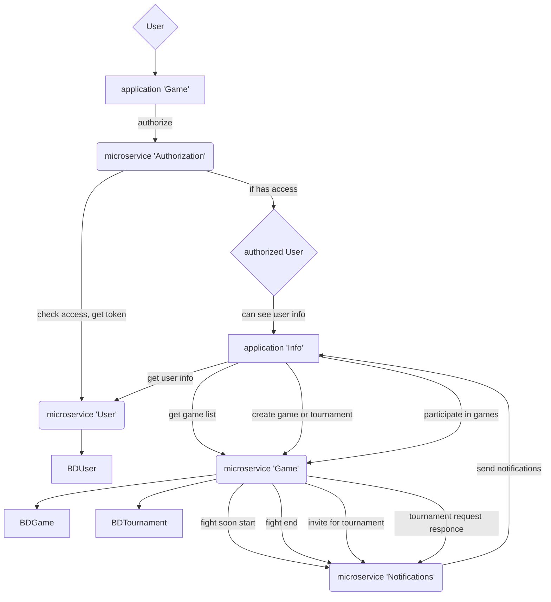

Здесь представлена схема связей микросервисов, описание эндпоинтов находится в соседнем файле (sw_swagger.yaml), его можно просмотреть [в редакторе сваггера](https://editor.swagger.io/), например.

[Полная схема](https://mermaid-js.github.io/mermaid-live-editor/edit#pako:eNp9U8Fu2zAM_RVCF7dA-gM5FMiQYdihvaw9NTsIMh0TiSVNkgu0Uf59pGzHrYvGB9ki33t8FK2TMq5GtVb7oH0LT9udBX6e7aZP7XPEcJLlvIzC3d09PGiyG-9ftPdHMjqRs1D90h1Wfwf8CGBs1kx0gd4xg2jcdGSCY6FXMgjVZswWjep2YEtQ6mTTojmANgZjXMEeEyR3QJtBnCyUJPRFgBpodRwVBgOltYupGsYuZ-LUZTbaQkSEXgJkG5fhN69fGpegND5IjJCiII5n9remy5n-2Mpm0Hh0iZq3BbYEx6KxuhX9iLYG-zF-sTjZkakshMqgpqKymZFj8Mn1wfLWpiH1Ic353NC-TRAdNx-TDikPfq9g2ec1ENlXSgiNCzzgqfQ1woyCgP96jPKO3lmDF9pyHMKTgexF5kgx5bn3zygTULOdAvxs6TuG51MgQ15oZAszFrBaqQ5Dp6nmm3YS6k6lFllFrfmzxkb3x7RTO3tmaO9rVvhZU3JBrRt9jLhS_K-6P2_WqHUKPU6gLWm-uN2IOv8HJmVJWA):



---

1. Неавторизованный пользователь авторизуется и получает доступ к функциям игры.

   [часть схемы про неавторизированного пользователя](https://mermaid-js.github.io/mermaid-live-editor/edit#pako:eNpdkD1uhDAQha8ymoZdib0ARSQiolSpkq1CipE9LNbiH9lmpQS4e2wgKXBheZ7ffH6eCYWVjBXePLkePprWQFpXU4-xvwb2U96WowqXyxO8kTK1c5_k3KAERWUNFK-kufja_LsheWdKjdarH54hM05aCW8T6KEEQ1HvtyujOG_dWczvzKJncQcSgkMo4cYRor2zmSEnOZCyVJzXeM9NLg4s1UFPYYdtWdZf_ueTK3XBEjV7TUqm2UwZ0mLsWXOLVTpK7mgcYoutydbRSYr8IlW0HquOhsAlJqR9_zYCq-hH_jM1itKo9e5afgFE84P6)

   ```mermaid
   graph TD;
       UnAuthUser{User}
       UnAuthUser --> MainApp[application 'Game']
       MainApp-->|authorize| Auth(microservice 'Authorization')
       Auth -->|check access, get token| User(microservice 'User') --> BDUser
       Auth -->|if has access| AuthUser{authorized User}
   ```

2. Авторизованный пользователь получает доступ к своей информации о пользователе и уведомлениям, а также к возможностям просмотреть список игр (завершённым, идущим, запланированным), создавать новые игры, а также принимать участие в играх. Под играми подразумеваются, как еденичные игры, так и турнирные.

   [часть схемы про авторизированного пользователя](https://mermaid-js.github.io/mermaid-live-editor/edit#pako:eNp9ks9ugzAMxl8lyoVV6l6Aw6ROnaZddll3GjtEwYClkmSJqdSVvvtsoPSPtHKA2P59Xxzig7a-BJ3rOprQqM26cIqfVUfNZ4J4MLzwEX-hVBIfuXZNqMfHp94apxKA6iSBrvK9euP3KoQvE8IWrSH0TmWSzL4LN1pMyOBQA12oxfihRRs9L3ZoQWWSyhbCque1BKPHuyes9jfskJw2TdlC_BO4UrnL_NziqZ1X08KNkaTmTSU4k1Ny47voOHQ0li7KXO8rrBtSyfPhE5lI_djvHZb7vAeh2yGBqnxUNG99T3CmVISfDpJ8U_DOwiy7vQ7RyYXUYrPFRP357NeUjWC4nQG8buk_ReC_gBaDyNANyjTAeqlbiK3BkqfxINJCUwPsonNellCZbkuFLtyR0S6U7PBSIvmo88psEyw1D6v_2Durc4odnKA1Gh7udqKOf07V_KI)

   ```mermaid
   graph TD;
       AuthUser{authorized User}
       AuthUser -->|can see user info| InfoApp[application 'Info']

       InfoApp -->|get user info|User(microservice 'User') --> BDUser
       Notify(microservice 'Notifications')-->|send notifications| InfoApp

       Game(microservice 'Game') --> BDGame
       Game --> BDTournament
           Game ---> |fight soon start|Notify
           Game ---> |fight end|Notify
           Game ---> |invite for tournament|Notify
           Game ---> |tournament request responce|Notify

       InfoApp ---> |get game list|Game
       InfoApp ---> |create game or tournament|Game
       InfoApp ---> |participate in games|Game
   ```
